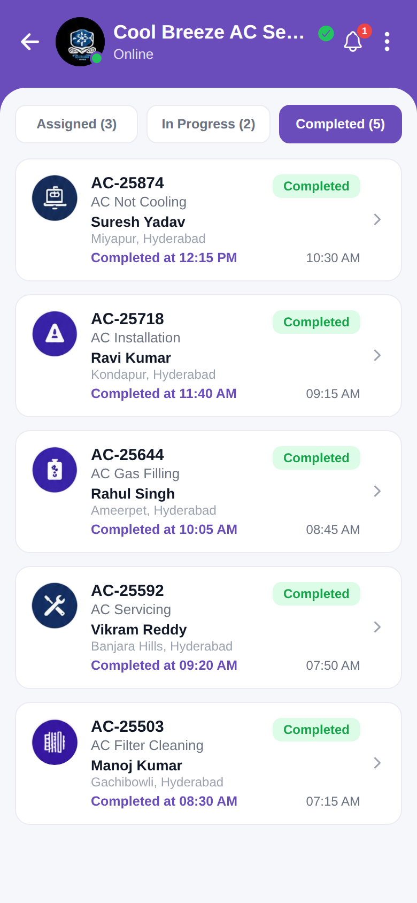

# Completed



Reproduction of the **Completed** jobs screen from `job/Completed.pdf`, packaged with the same
structure as `screen_chat`. Shows the Jobs list with Assigned / In Progress / Completed
tabs (this folder opens on the **Completed** tab). Each job card shows id, type, customer,
location, time and a priority/completed badge. Tabs are tappable. Brand purple `#6A4DBB`.

## Run
```bash
cd frontend && npm install && npx expo start   # press w for web
```
