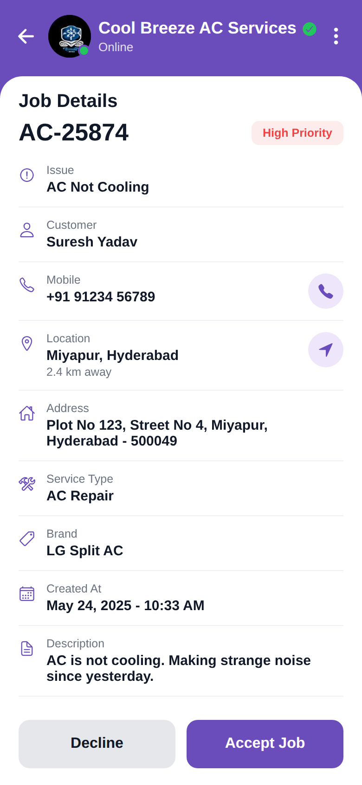

# Job Details

<p align="center"></p>

Reproduction of the **Job Details** screen from `job/Job_details.pdf` (same structure as
`screen_chat`). Shows job AC-25874 with a High Priority badge and info rows (Issue,
Customer, Mobile with call button, Location with navigate button, Address, Service Type,
Brand, Created At, Description), a row of 4 AC photos (extracted from the PDF), a Customer
Note, and Decline / Accept Job buttons. Brand purple `#6A4DBB`.

## Run
```bash
cd frontend && npm install && npx expo start   # press w for web
```
