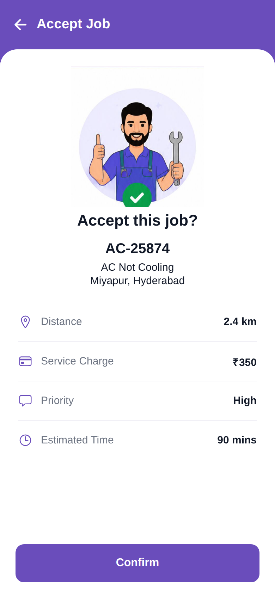

# Accept Job

<p align="center"></p>

Reproduction of the **Accept Job** screen from `job/accept_job.pdf` (same structure as
`screen_chat`). A thumbs-up technician illustration (extracted from the PDF), "Accept this
job?", job AC-25874 summary, detail rows (Distance 2.4 km, Service Charge ₹350, Priority
High, Estimated Time 90 mins) and a Confirm button. Brand purple `#6A4DBB`.

## Run
```bash
cd frontend && npm install && npx expo start   # press w for web
```
