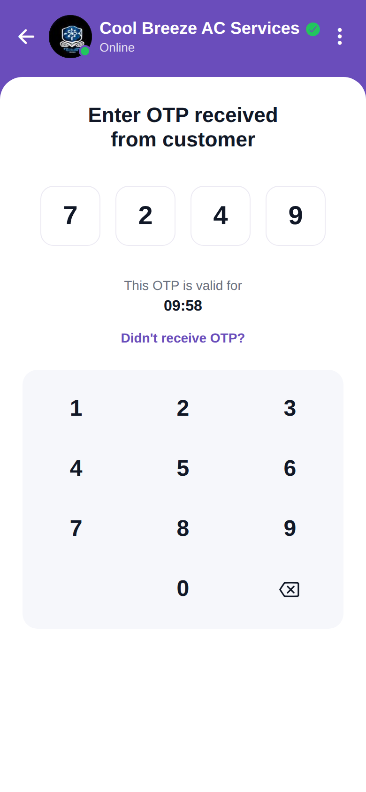

# Enter OTP



Reproduction of the **enter_otp** screen from `job/enter_otp.pdf` (same structure as
`screen_chat`). "Enter OTP received from customer", four OTP boxes (pre-filled 7249), a
validity timer, a "Didn't receive OTP?" link, and an interactive numeric keypad (digits +
backspace). Brand purple `#6A4DBB`.

## Run
```bash
cd frontend && npm install && npx expo start   # press w for web
```
