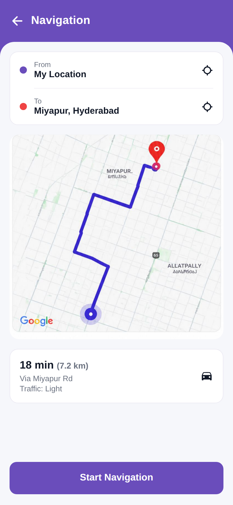

# Navigation

<p align="center"></p>

Reproduction of the **Navigation** screen from `job/navigation.pdf` (same structure as
`screen_chat`). From/To location cards, a route map (extracted from the PDF), an ETA card
(18 min · 7.2 km · Via Miyapur Rd · Traffic: Light) and a Start Navigation button.
Brand purple `#6A4DBB`.

## Run
```bash
cd frontend && npm install && npx expo start   # press w for web
```
