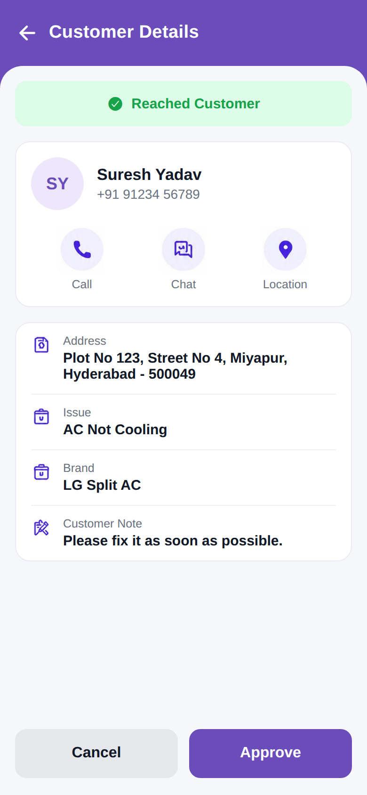

# Reached Customer (Customer Details)

<p align="center"></p>

Reproduction of the **reached_customer** screen from `job/reached_customer.pdf` (same
structure as `screen_chat`). A green "Reached Customer" banner, a customer card (SY avatar,
Suresh Yadav, phone, Call/Chat/Location actions), detail rows (Address, Issue, Brand,
Customer Note) and Cancel / Approve buttons. Brand purple `#6A4DBB`.

## Run
```bash
cd frontend && npm install && npx expo start   # press w for web
```
