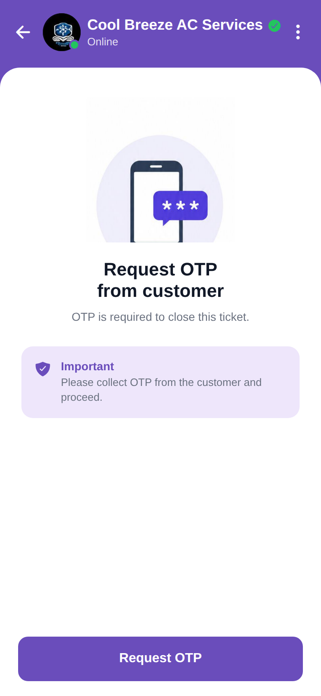

# Request OTP

<p align="center"></p>

Reproduction of the **request_otp** screen from `job/request_otp.pdf` (same structure as
`screen_chat`). A phone/OTP illustration (from the PDF), "Request OTP from customer", an
Important note box, and a Request OTP button. Brand purple `#6A4DBB`.

## Run
```bash
cd frontend && npm install && npx expo start   # press w for web
```
