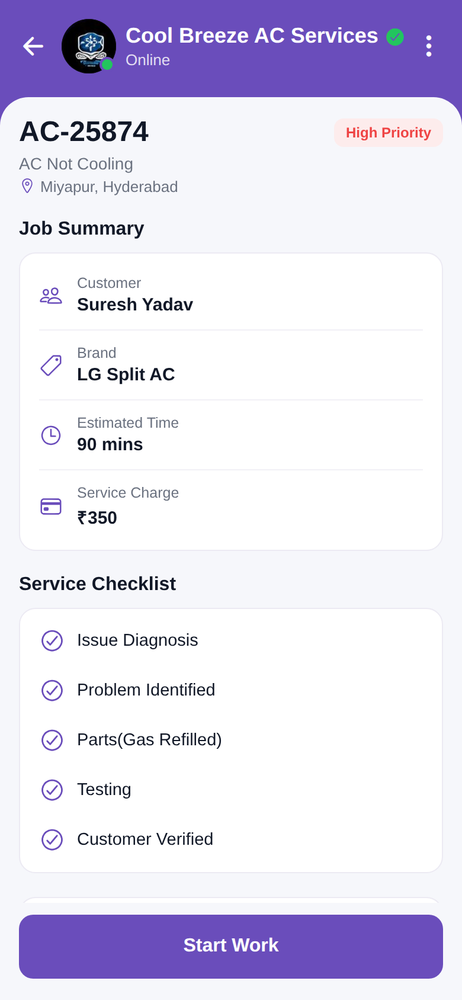

# Start Work



Reproduction of the **start_work** screen from `job/start_work.pdf` (same structure as
`screen_chat`). Job AC-25874 header, a Job Summary card (Customer, Brand, Estimated Time,
Service Charge), a Service Checklist, Work Notes, and a Start Work button.
Brand purple `#6A4DBB`.

## Run
```bash
cd frontend && npm install && npx expo start   # press w for web
```
