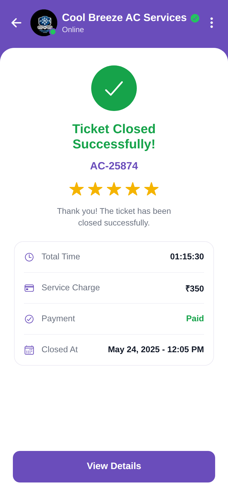

# Ticket Closed

<p align="center"></p>

Reproduction of the **ticket_closed** screen from `job/ticket_closed.pdf` (same structure
as `screen_chat`). A green success check, "Ticket Closed Successfully!", AC-25874, a 5-star
rating, a summary card (Total Time, Service Charge, Payment Paid, Closed At) and a View
Details button. Brand purple `#6A4DBB`.

## Run
```bash
cd frontend && npm install && npx expo start   # press w for web
```
