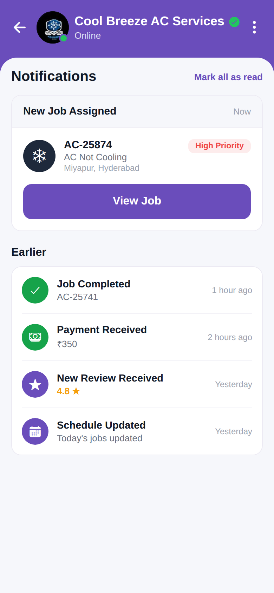

# View Job (Notifications)

<p align="center"></p>

Reproduction of the **View Job / Notifications** screen from `job/view_job.pdf` (same
structure as `screen_chat`). Shows a "New Job Assigned" card (AC-25874, High Priority,
View Job button) and an "Earlier" list of notifications (Job Completed, Payment Received,
New Review, Schedule Updated). Brand purple `#6A4DBB`.

## Run
```bash
cd frontend && npm install && npx expo start   # press w for web
```
