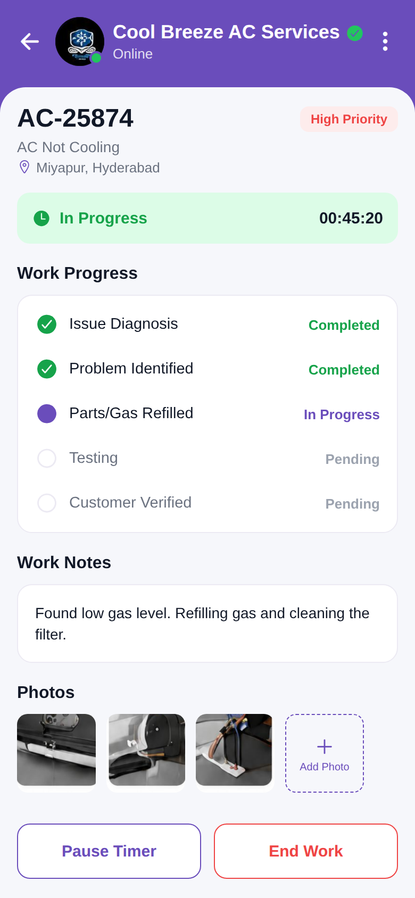

# Work Progress

<p align="center"></p>

Reproduction of the **work_progress** screen from `job/work_progress.pdf` (same structure
as `screen_chat`). Job AC-25874 header, a green "In Progress" banner with a timer, a Work
Progress checklist (Completed / In Progress / Pending), Work Notes, 3 work photos (from the
PDF) + Add Photo, and Pause Timer / End Work buttons. Brand purple `#6A4DBB`.

## Run
```bash
cd frontend && npm install && npx expo start   # press w for web
```
