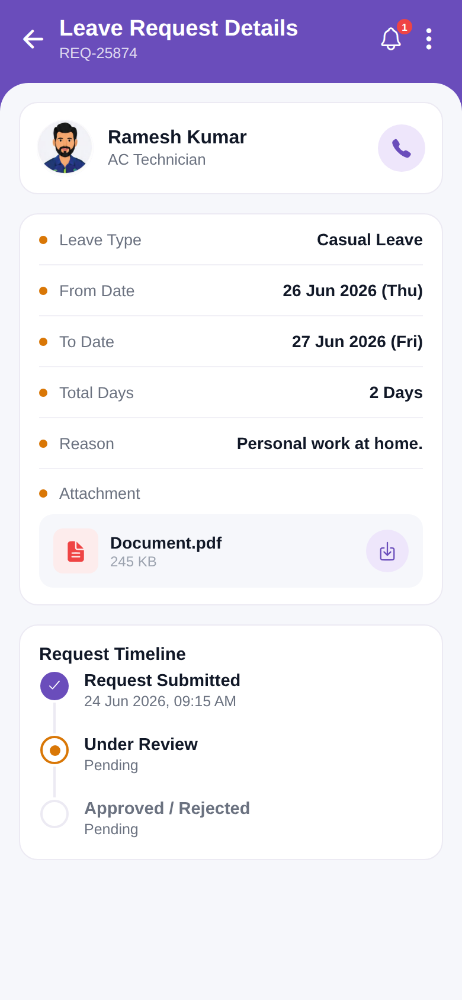

# leave_request_pending



Reproduction of the **leave_request_pending** screen from `leave_request/leave_request_pending.pdf` (same structure as
`screen_chat`). Leave Request Details: profile, detail rows, attachment, and a request timeline (pending). Brand purple `#6A4DBB`.

## Run
```bash
cd frontend && npm install && npx expo start   # press w for web
```
