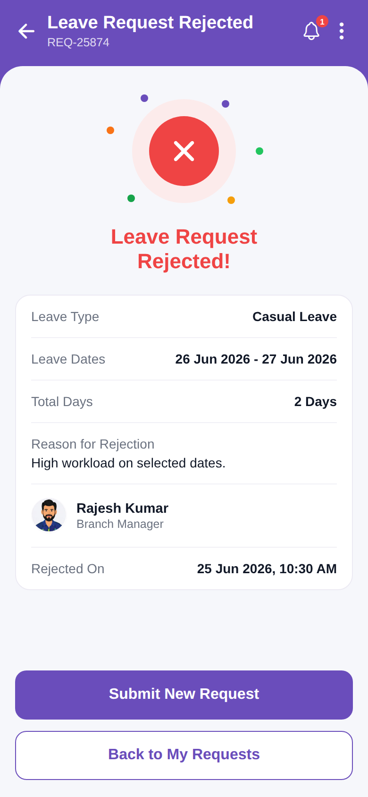

# leave_request_rejected

<p align="center"></p>

Reproduction of the **leave_request_rejected** screen from `leave_request/leave_request_rejected.pdf` (same structure as
`screen_chat`). Rejected result screen with reason, approver, Submit New Request / Back buttons. Brand purple `#6A4DBB`.

## Run
```bash
cd frontend && npm install && npx expo start   # press w for web
```
