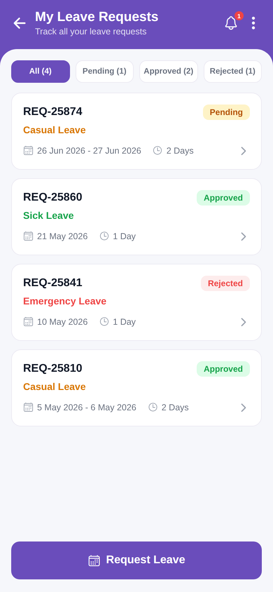

# my_leave_request



Reproduction of the **my_leave_request** screen from `leave_request/my_leave_request.pdf` (same structure as
`screen_chat`). My Leave Requests list with All/Pending/Approved/Rejected tabs and a Request Leave button. Brand purple `#6A4DBB`.

## Run
```bash
cd frontend && npm install && npx expo start   # press w for web
```
