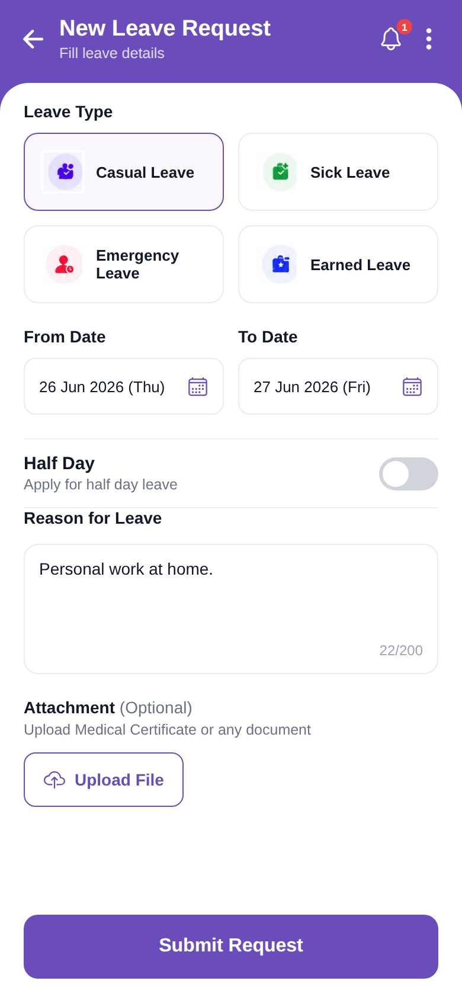

# new_leave

<p align="center"></p>

Reproduction of the **new_leave** screen from `leave_request/new_leave.pdf` (same structure as
`screen_chat`). New Leave Request form: leave-type cards, From/To dates, Half Day toggle, reason, attachment upload, Submit. Brand purple `#6A4DBB`.

## Run
```bash
cd frontend && npm install && npx expo start   # press w for web
```
