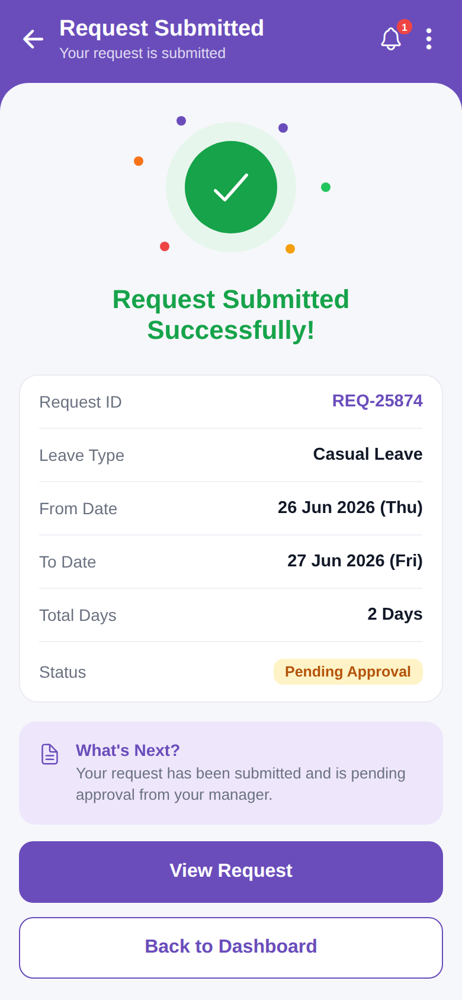

# request_submitted

<p align="center"></p>

Reproduction of the **request_submitted** screen from `leave_request/request_submitted.pdf` (same structure as
`screen_chat`). Success screen: Request Submitted Successfully with summary card and What's Next box. Brand purple `#6A4DBB`.

## Run
```bash
cd frontend && npm install && npx expo start   # press w for web
```
