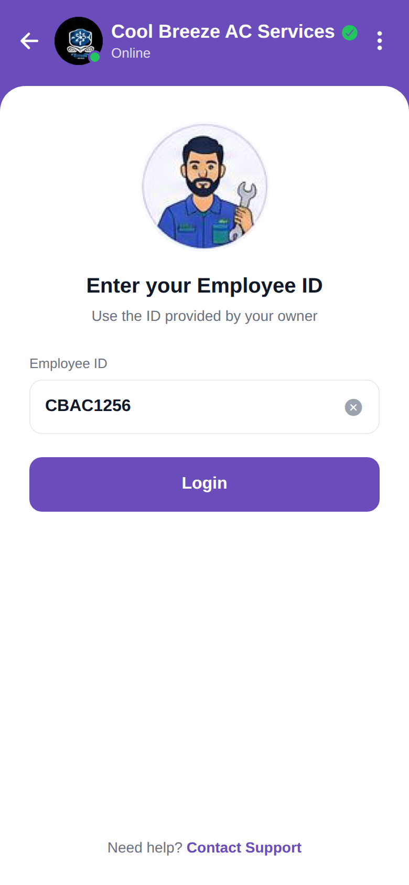

# Login

<p align="center"></p>

Reproduction of the **Login** screen from `profile/Login.pdf`, packaged with the same
structure as `screen_chat` (backend / frontend / memory / test_reports / tests).

## What this screen does

An **Employee ID login** for the technician app:

- A purple company header (logo + online dot, "Cool Breeze AC Services" with a verified
  badge, "Online", back chevron, ⋮ menu).
- A technician illustration, the heading **"Enter your Employee ID"**, and a hint
  *"Use the ID provided by your owner"*.
- An **Employee ID** text field (pre-filled `CBAC1256`) with a ✕ button that clears it.
- A full-width **Login** button (disabled when the field is empty) — hook real auth here.
- A **"Need help? Contact Support"** footer link.

The UI is static (local state only); no backend is called. Brand purple is `#6A4DBB`.

## Run

```bash
cd frontend
npm install
npx expo start    # press w for web, or scan the QR with Expo Go
```

The Expo app lives in `frontend/`. See `frontend/README.md` for the file-by-file
breakdown.
