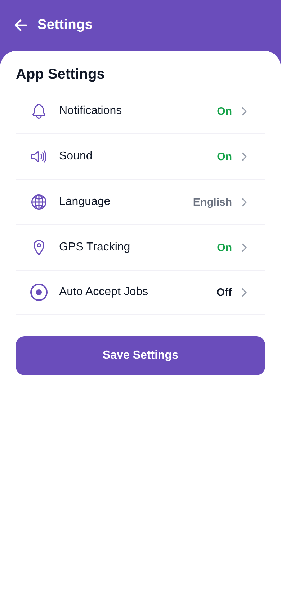

# Settings Screen



A static reproduction of the **Settings** screen from `profile/Settings.pdf`, built as an
Expo (React Native + expo-router) app using the same structure and conventions as
`screen_chat.zip`.

## Functionality

- **Header** — purple bar with a back chevron and the title *Settings*.
- **App Settings card** — rows with a purple leading icon, label, a coloured value and a
  chevron:
  - Notifications · **On**, Sound · **On**, Language · **English**, GPS Tracking · **On**,
    Auto Accept Jobs · **Off**.
  - Toggle rows (everything except Language) flip between **On** (green) and **Off** (dark)
    when tapped. Language is a fixed select value (grey).
- **Save Settings** — full-width purple button. Persist the values to your backend here.

State is local (`useState`) — this is a static UI; no backend calls are wired.

## Run

```bash
npm install
npx expo start
```

Press `w` for web (use the browser device toolbar for a phone frame), or scan the QR
code with Expo Go.

## Structure

```
app/
  _layout.tsx          Root Stack + icon-font loading (headers hidden)
  index.tsx            Entry route -> <SettingsScreen/>
  settings.tsx         /settings route -> <SettingsScreen/>
  +html.tsx            Web document shell
src/
  screens/SettingsScreen.tsx      App Settings rows + Save button
  components/
    ScreenHeader.tsx              Purple back + title bar
    SettingsRow.tsx               One settings row (purple icon, label, value, chevron)
  constants/
    colors.ts                     Central palette (brand purple = #6A4DBB)
    settingsData.ts               Toggle/select rows
  hooks/use-icon-fonts.ts
constants/testIds/                testID registry (SETTINGS.*)
```

## Notes

- Brand purple is **`#6A4DBB`** (header, row icons, Save button). "On" values are green,
  "Off"/select values are dark/grey, matching the design.
- This screen has no images to extract.
