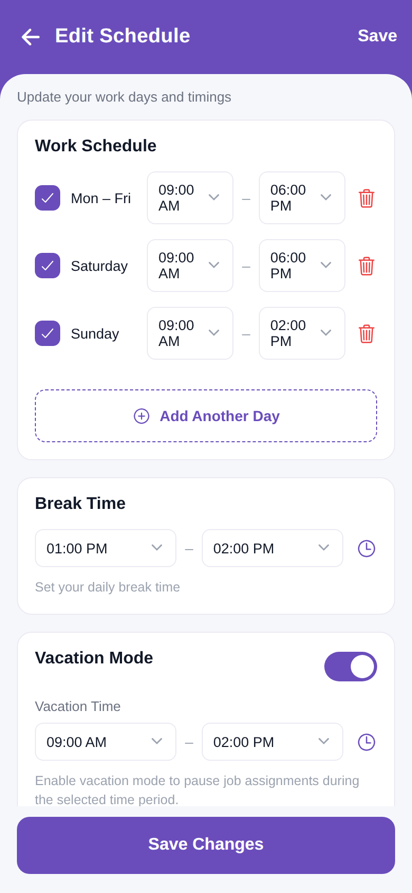

# Edit Schedule Screen



A static reproduction of the **Edit Schedule** screen from `profile/Edit timings.pdf`,
built as an Expo (React Native + expo-router) app using the same structure and
conventions as `screen_chat.zip`.

## Functionality

- **Header** — purple bar with a back chevron, title *Edit Schedule*, and a **Save**
  text action; a subtitle "Update your work days and timings" sits at the top of the body.
- **Work Schedule** card — each day row has a purple **checkbox**, start/end **time
  dropdowns** (chevron), and a red **delete** icon. A dashed **Add Another Day** button
  follows. Checkboxes toggle and delete removes the row (local state).
- **Break Time** card — start/end dropdowns, a clock icon and a caption.
- **Vacation Mode** card — a purple **toggle**, a "Vacation Time" range and a caption.
- **Note** box — lavender info box about changes applying after saving.
- **Save Changes** — purple button pinned at the bottom.

State is local (`useState`); this is a static UI with no backend calls.

## Run

```bash
npm install
npx expo start
```

Press `w` for web (use the browser device toolbar for a phone frame), or scan the QR
code with Expo Go.

## Structure

```
app/
  _layout.tsx          Root Stack + icon-font loading (headers hidden)
  index.tsx            Entry route -> <EditScheduleScreen/>
  edit-schedule.tsx    /edit-schedule route -> <EditScheduleScreen/>
  +html.tsx            Web document shell
src/
  screens/EditScheduleScreen.tsx  Work days, break, vacation, note + Save
  components/
    ScreenHeader.tsx              Purple back + title + right action bar
    TimeDropdown.tsx              Bordered time field with chevron
    Checkbox.tsx                  Purple rounded checkbox
    AddDayButton.tsx              Dashed "Add Another Day" button
    Toggle.tsx                    Custom pill toggle (configurable on-colour)
  constants/
    colors.ts                     Central palette (brand purple = #6A4DBB)
    editScheduleData.ts           Initial days / break / vacation
  hooks/use-icon-fonts.ts
constants/testIds/                testID registry (EDIT_SCHEDULE.*)
```

## Notes

- Brand purple is **`#6A4DBB`** (header, checkboxes, dropdownchevrons, toggle, Save). The
  delete icons use red. No images to extract.
- `Edit timings_2.pdf` is the same screen with an empty body (an empty-state export).
