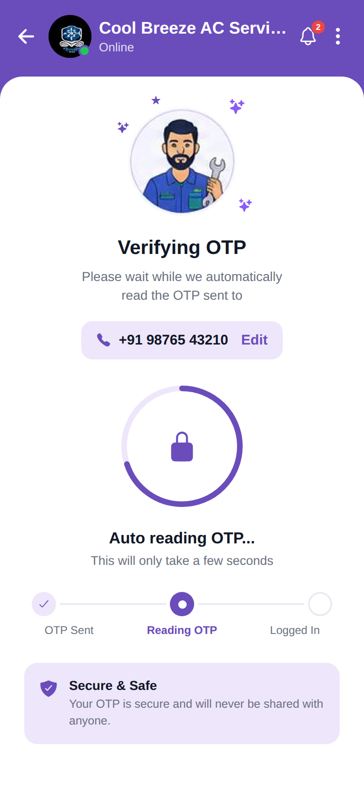

# OTP Verifying

<p align="center"></p>

Reproduction of the **Verifying OTP** screen from `profile/OTP verifying.pdf`, packaged
with the same structure as `screen_chat` (backend / frontend / memory / test_reports /
tests).

## What this screen does

The auto-OTP verification step of the login flow:

- A purple company header (logo + online dot, "Cool Breeze AC Services", "Online", a
  **notification bell with a "2" badge**, and a ⋮ menu).
- The technician illustration with decorative sparkles.
- **"Verifying OTP"** with a hint and a phone chip (`+91 98765 43210`) with an **Edit** link.
- A **circular progress ring** with a lock icon (auto-reading state).
- **"Auto reading OTP..."** status text.
- A 3-step progress indicator: **OTP Sent** (done) → **Reading OTP** (active) → **Logged In**
  (pending).
- A **Secure & Safe** info box.

Static UI (no backend, no real OTP read). Brand purple is `#6A4DBB`.

## Run

```bash
cd frontend
npm install
npx expo start    # press w for web, or scan the QR with Expo Go
```

Note: this screen uses `react-native-svg` (already listed in package.json) for the
progress ring. The Expo app lives in `frontend/`; see `frontend/README.md` for details.
