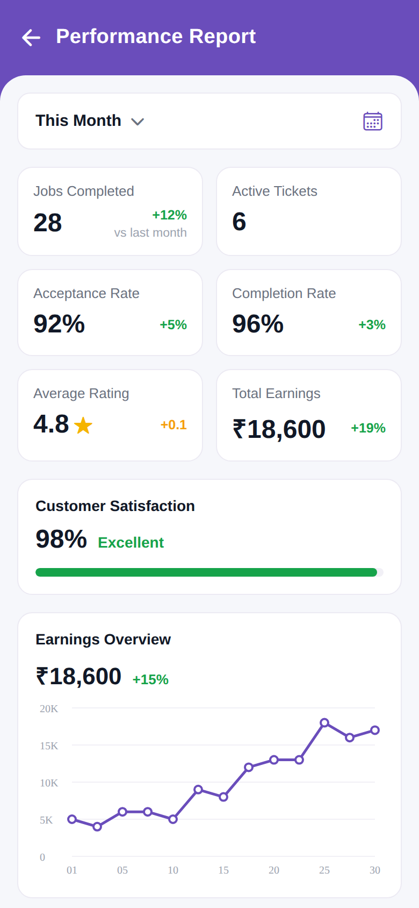

# Performance Report

<p align="center"></p>

Reproduction of the **Performance Report** screen from `profile/Performance Report.pdf`,
packaged with the same structure as `screen_chat` (backend / frontend / memory /
test_reports / tests).

## What this screen does

A technician analytics dashboard:

- A purple header (`← Performance Report`).
- A **This Month** period selector (with a calendar icon).
- A 2-column grid of **stat cards**: Jobs Completed (28, +12% vs last month), Active
  Tickets (6), Acceptance Rate (92%, +5%), Completion Rate (96%, +3%), Average Rating
  (4.8★, +0.1), Total Earnings (₹18,600, +19%).
- A **Customer Satisfaction** card (98% · Excellent) with a green progress bar.
- An **Earnings Overview** card (₹18,600, +15%) with a line chart.

Static UI; no backend. Brand purple is `#6A4DBB`; growth deltas are green.

## Run

```bash
cd frontend
npm install
npx expo start    # press w for web, or scan the QR with Expo Go
```

Note: this screen uses `react-native-svg` (already in package.json) for the line chart.
The Expo app lives in `frontend/`; see `frontend/README.md` for details.
