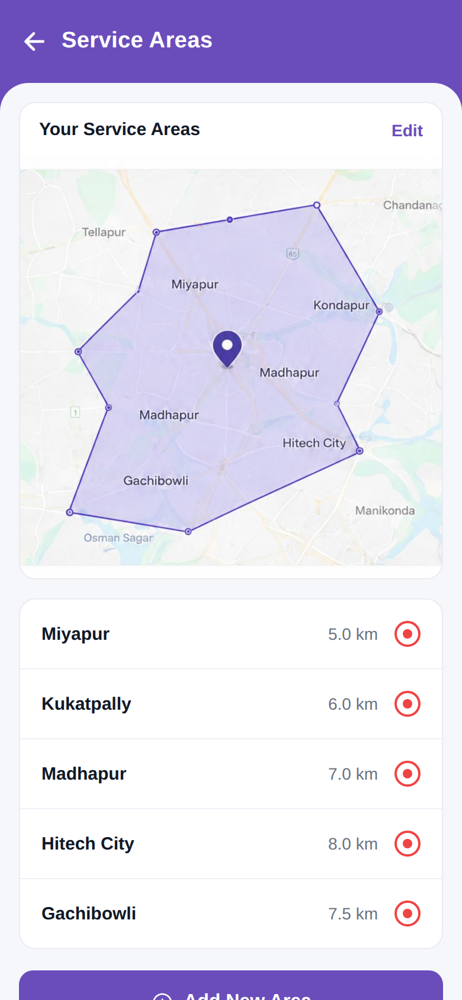

# Service Areas

<p align="center"></p>

Reproduction of the **Service Areas** screen from `profile/Service Areas.pdf`, packaged
with the same structure as `screen_chat` (backend / frontend / memory / test_reports /
tests).

## What this screen does

Shows the technician's coverage:

- A purple header (`← Service Areas`).
- A **map card** ("Your Service Areas" + an Edit link) showing the coverage polygon and a
  location pin (a static map image lifted from the PDF).
- A **list** of covered areas with distances and a red target marker: Miyapur (5.0 km),
  Kukatpally (6.0 km), Madhapur (7.0 km), Hitech City (8.0 km), Gachibowli (7.5 km).
- A full-width purple **Add New Area** button.

Static UI; no backend. Brand purple is `#6A4DBB`.

## Run

```bash
cd frontend
npm install
npx expo start    # press w for web, or scan the QR with Expo Go
```

The Expo app lives in `frontend/`; see `frontend/README.md` for details.
