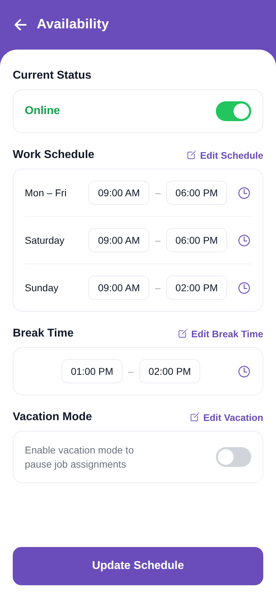

# Availability (timings)

<p align="center"></p>

Reproduction of the **Availability** screen from `profile/timings.pdf`, packaged with the
same structure as `screen_chat` (backend / frontend / memory / test_reports / tests).

## What this screen does

Manages the technician's working hours and availability:

- A purple header (`← Availability`).
- **Current Status** — an *Online/Offline* card with a green toggle.
- **Work Schedule** (with an *Edit Schedule* link) — Mon–Fri, Saturday and Sunday rows,
  each showing a start–end time range and a clock icon.
- **Break Time** (with an *Edit Break Time* link) — a single time range.
- **Vacation Mode** (with an *Edit Vacation* link) — a description and an off toggle to
  pause job assignments.
- A pinned **Update Schedule** button at the bottom.

Toggles are interactive (local state); the UI is static with no backend calls. Brand
purple is `#6A4DBB`.

## Run

```bash
cd frontend
npm install
npx expo start    # press w for web, or scan the QR with Expo Go
```

The Expo app lives in `frontend/`. See `frontend/README.md` for the file-by-file
breakdown.
