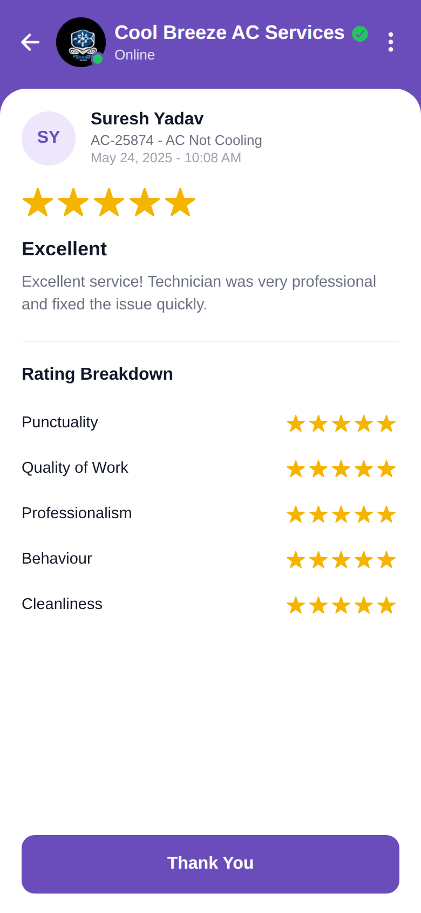

# Overall Review

<p align="center"></p>

Reproduction of the **overall_review** screen from `reviews/overall_review.pdf` (same
structure as `screen_chat`). Reviewer card (SY, Suresh Yadav, job, date), 5 stars,
"Excellent" + review text, a Rating Breakdown (Punctuality, Quality of Work,
Professionalism, Behaviour, Cleanliness) and a "Thank You" button. Brand purple `#6A4DBB`.

## Run
```bash
cd frontend && npm install && npx expo start   # press w for web
```
